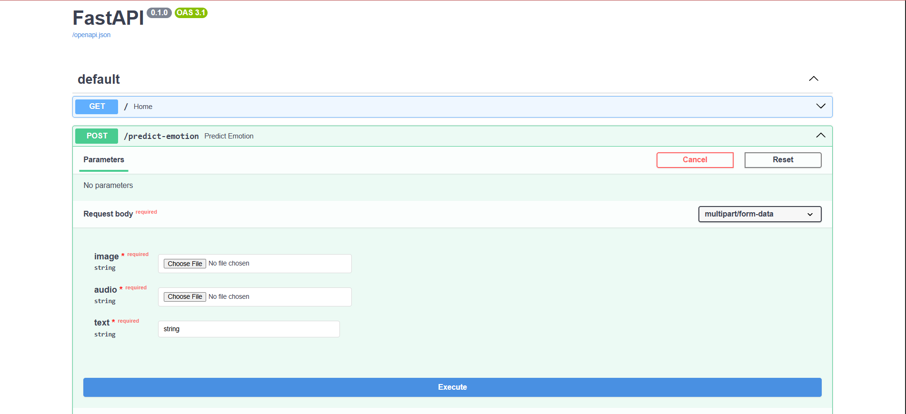
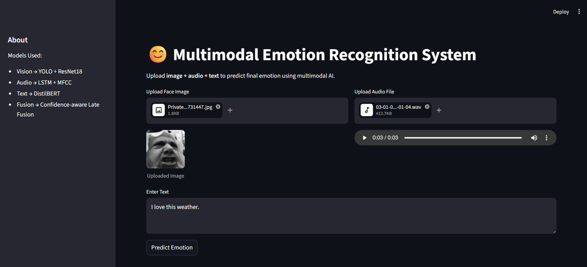
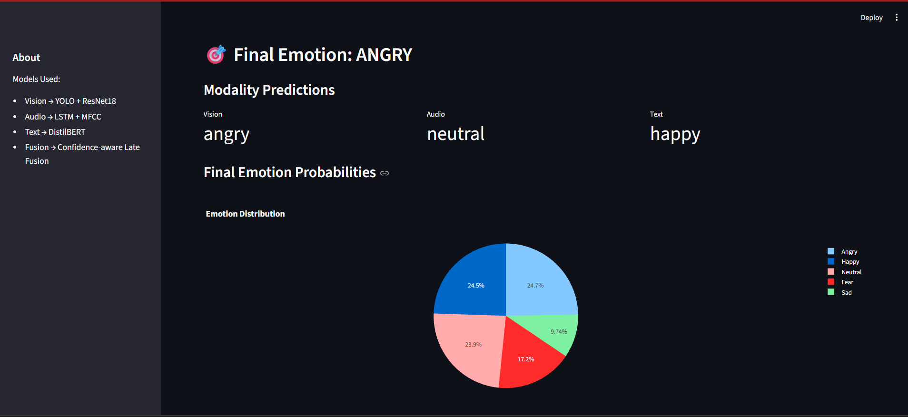

# Multimodal Emotion Recognition System

A production-style multimodal AI system that predicts human emotions using:

* Facial Expressions (Vision)
* Speech Tone (Audio)
* Text Sentiment (NLP)

### Supported Emotions

* Happy
* Sad
* Angry
* Neutral
* Fear

---

## System Architecture

```text
Image --------\
               \
Audio ---------> Fusion Model ---> Final Emotion
               /
Text ---------/
```

### Models Used

| Modality | Model             |
| -------- | ----------------- |
| Vision   | YOLOv8 + ResNet18 |
| Audio    | MFCC + LSTM       |
| Text     | DistilBERT        |

---

## Architecture

### Vision Pipeline

```text
Image/Webcam Frame
        ↓
YOLO Face Detection
        ↓
ResNet18 Emotion Classifier
        ↓
Emotion Probabilities
```

**Dataset:** FER2013
**Accuracy:** 61%

---

### Audio Pipeline

```text
Audio Input (.wav)
        ↓
MFCC Feature Extraction (Librosa)
        ↓
LSTM Model
        ↓
Emotion Probabilities
```

**Dataset:** RAVDESS
**Accuracy:** 61%

---

### Text Pipeline

```text
Text Input
        ↓
DistilBERT Tokenization
        ↓
DistilBERT Classifier
        ↓
Emotion Probabilities
```

**Dataset:** GoEmotions
**Accuracy:** 82%

---

### Fusion Pipeline

Emotion probabilities from all modalities are combined using a **Confidence-Aware Late Fusion** strategy.

#### Default Fusion Weights

* Vision → 0.4
* Audio → 0.3
* Text → 0.3

#### Confidence Boosting

If any modality predicts with confidence greater than **95%**, its contribution is automatically increased during fusion.

#### Final Output

* Final Emotion
* Final Probability Distribution

---

## Key Highlights

* Multimodal Emotion Recognition using Vision, Audio and Text
* Confidence-Aware Late Fusion Strategy
* Real-time Face Detection using YOLOv8
* DistilBERT-based Text Emotion Classification
* FastAPI Backend for Model Serving
* Streamlit Frontend for Interactive Predictions
* End-to-End ML Pipeline from Training to Deployment
* Real-Time Emotion Prediction API
* Probability-Based Emotion Interpretation

---

## Tech Stack

| Category         | Technology                  |
| ---------------- | --------------------------- |
| Backend          | FastAPI                     |
| Frontend         | Streamlit                   |
| Deep Learning    | PyTorch                     |
| NLP              | DistilBERT                  |
| Computer Vision  | YOLOv8, ResNet18            |
| Audio Processing | Librosa, MFCC               |
| Data Processing  | NumPy, Pandas, Scikit-learn |

---

## Folder Structure

```text
emotion-recognition-system/
│
├── src/
│   ├── models/
│   ├── training/
│   ├── inference/
│   ├── api/
│   ├── data/
│   └── utils/
│
├── notebooks/
├── screenshots/
├── data/
├── checkpoints/
├── frontend.py
├── requirements.txt
└── README.md
```

---

## API Endpoint

### POST `/predict-emotion`

#### Inputs

* Image File
* Audio File
* Text Input

#### Returns

* Vision Prediction
* Audio Prediction
* Text Prediction
* Final Fused Emotion
* Final Probability Distribution

---

## Results

| Modality | Dataset    | Accuracy |
| -------- | ---------- | -------- |
| Vision   | FER2013    | 61%      |
| Audio    | RAVDESS    | 61%      |
| Text     | GoEmotions | 82%      |

---

## Demo

### FastAPI Backend API



### Streamlit Frontend



### Prediction Results



---

## Features

* Real-Time Webcam Emotion Detection
* Image Upload Support
* Audio Upload Support
* Text Emotion Analysis
* FastAPI Backend
* Streamlit Frontend
* Multimodal Fusion
* Confidence-Aware Decision Making
* Probability Visualization

---

## Future Improvements

* Video Emotion Recognition
* Trainable Fusion Network
* Cloud Deployment
* Additional Emotion Classes (Surprise, Disgust)
* Model Monitoring and Analytics

---

## How to Run

### Install Dependencies

```bash
pip install -r requirements.txt
```

### Train Models

```bash
python -m src.training.train_vision
python -m src.training.train_audio
python -m src.training.train_text
```

### Run FastAPI Backend

```bash
uvicorn src.api.main:app --reload
```

### Open API Documentation

```text
http://127.0.0.1:8000/docs
```

### Run Streamlit Frontend

```bash
streamlit run frontend.py
```

---

## Real World Applications

* Mental Health Assistants
* Customer Support Analysis
* Interview Analytics
* Smart Education Systems
* Healthcare Monitoring
* Human-Computer Interaction
* Call Center Emotion Monitoring
* AI-Powered Conversational Systems

---

## Note

Pretrained model checkpoints are excluded from this repository due to GitHub file size limitations. Models can be retrained using the provided training pipelines.
